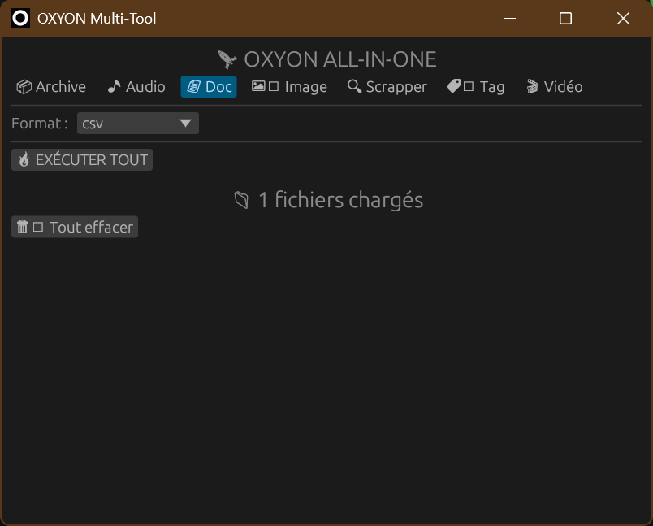
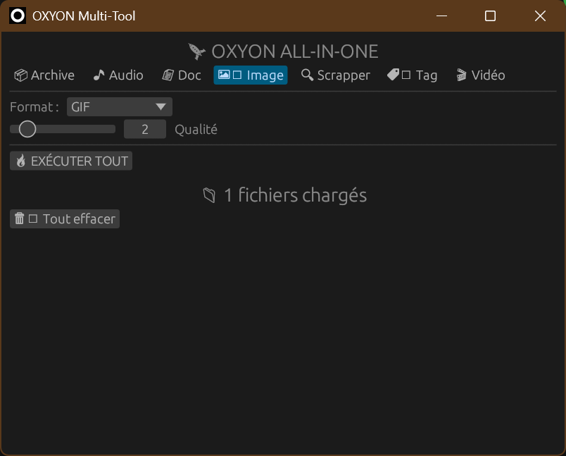
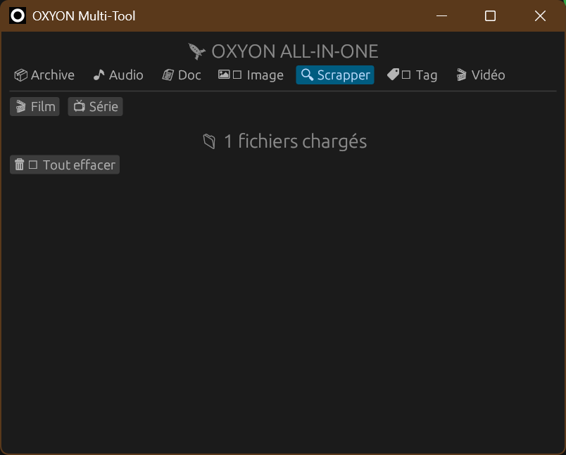
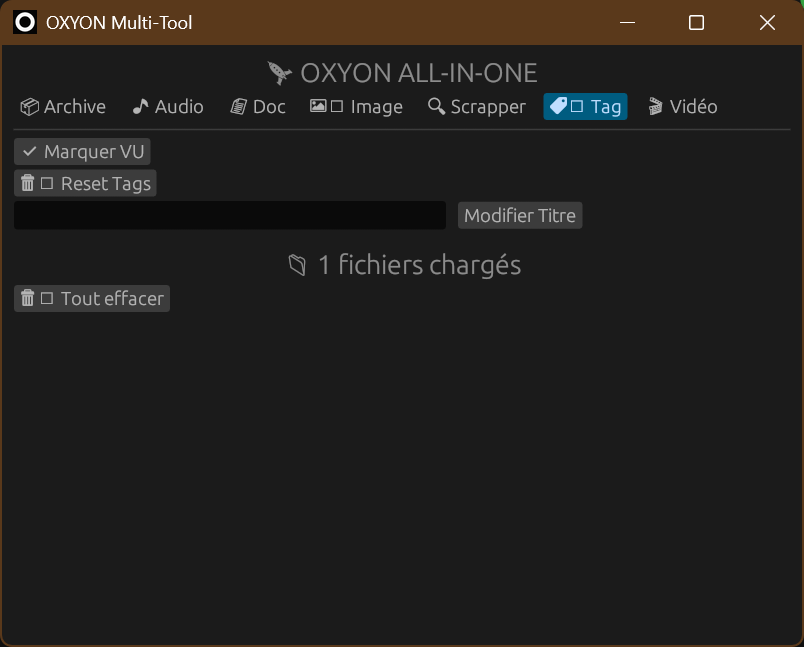

# Oxyon


[](LICENSE.txt)
[](https://www.rust-lang.org/)

**Oxyon** is a unified multimedia toolbox built in Rust:  
file conversion, movie & TV scraping, and media tagging — all in one graphical interface.

## 🎯 Overview

Oxyon provides an easy-to-use GUI interface for major file processing libraries  
**and media databases**, making complex multimedia workflows accessible without the command line.
- **7zip** – Archive compression and decompression
- **ExifTool** – Metadata reading and writing for images, videos, and documents
- **FFmpeg** – Audio and video encoding, decoding, and conversion
- **MKVToolNix** – MKV file creation and manipulation
- **Pandoc** – Universal document converter

### 🔁 File Conversion
- 🎬 **Video Conversion**: Convert between common video formats (MP4, MKV, AVI, etc.)
- 🎵 **Audio Processing**: Extract, convert, and process audio tracks
- 📄 **Document Conversion**: Transform documents between formats (PDF, DOCX, HTML, Markdown…)
- 📦 **Archive Management**: Create and extract compressed archives

### 🏷️ Metadata & Tagging
- 🖼️ **Image Metadata**: Read and edit EXIF metadata
- 🎞️ **Media Tagging**: Write metadata directly into media files (titles, dates, artwork)

### 🎭 Media Scraping
- 🎬 **Movie & TV Metadata**: Fetch information from TMDB and FanArt
- 🖼️ **Artwork Retrieval**: Posters, backdrops, logos, and fanart

### 🎨 Interface
- 🧭 **Unified GUI**: One consistent interface for all tools
- ⚙️ **Tool Abstraction**: Powerful CLI tools without command-line complexity


### Verify Installation

```bash
7z --help
exiftool -ver
ffmpeg -version
mkvmerge --version
mkvpropedit --version
pandoc --version
```

## 🚀 Installation

1. **Clone the repository**

```bash
git clone https://github.com/Promethyxx/oxyon.git
cd oxyon
```

2. **Set up API keys** (optional, for media metadata features)

Create a `.env` file in the root directory:

```bash
cp example.env .env
```

Then edit `.env` and add your API keys:

```env
TMDB_KEY=your_tmdb_api_key_here
FANART_KEY=your_fanart_api_key_here
```

**How to get API keys:**
- TMDB: Register at [https://www.themoviedb.org/settings/api](https://www.themoviedb.org/settings/api)
- FanArt: Register at [https://fanart.tv/get-an-api-key/](https://fanart.tv/get-an-api-key/)

> ⚠️ **Note**: API keys are only required if you want to use the media metadata features. Basic file conversion works without them.

3. **Build the project**

```bash
cargo build --release
```

4. **Run Oxyon**

```bash
./target/release/oxyon
```

Or on Windows:

```bash
.\target\release\oxyon.exe
```

## 📸 Screenshots

### Archive


### Audio


### Document


### Image


### Scraping


### Media Tagging


### Video


## 🗺️ Roadmap (planned)

The features are actively planned and tracked via GitHub issues.

## 🤝 Contributing

Contributions are welcome! Please feel free to submit a Pull Request. For major changes, please open an issue first to discuss what you would like to change.

## 📝 License

This project is licensed under the GNU General Public License v3.0 - see the [LICENSE.txt](LICENSE.txt) file for details.
