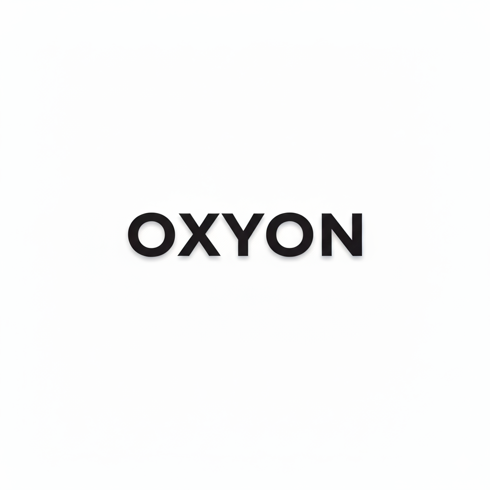

# Oxyon & Oxyon Office

## 🎯 Overview
Oxyon is a GUI file converter, editor, scraper and tagger built with Rust.

**Oxyon Office** is a lightweight version with only document and image conversion.

This is my first software project, built with AI assistance. Contributions and feedback are welcome!

## ✨ Features
- 📄 **Document conversion** - DOCX, PDF, MD, ODT, HTML, TEX
- 🖼️ **Image processing** - 15+ formats including AVIF, RAW, SVG, PSD
- 🎬 **Media scraping** - Fetch metadata from TMDB
- 🏷️ **File tagging** - Add metadata to MKV files
- 📦 **Archive management** - 7Z, ZIP, TAR compression
- 🎵 **Audio conversion** - MP3, FLAC, AAC, OGG

## 🚀 Quick Start
1. Download the latest release from [Releases](../../releases)
2. Run the executable
3. Drag & drop your files or locate it
4. Select output format
5. Click "Execute"

## 🗺️ Roadmap
Features are actively tracked via [GitHub Issues](../../issues).

## 📝 License
This project is licensed under the GNU General Public License v3.0 - see the [LICENSE.txt](LICENSE.txt) file for details.