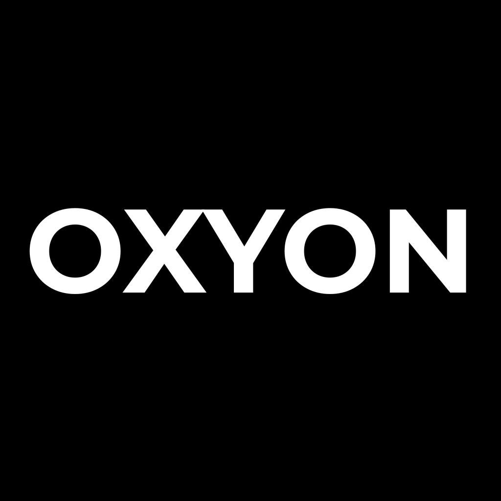

# Oxyon & Oxyon Desk



[](LICENSE.txt)
[](https://www.rust-lang.org/)

## Overview

Oxyon is a desktop multimedia toolkit built with Rust and [egui](https://github.com/emilide/egui). It handles file conversion, renaming, tagging and scraping in a single GUI application, with bundled binaries (ffmpeg, ffprobe, mkvpropedit) — no external tools to install.

**Oxyon Desk** is a lightweight variant with only document and image conversion, no bundled binaries and no API calls.

Available in English and French.

## Features

- **Archive** — 7Z, ZIP, TAR compression and extraction
- **Audio** — MP3, FLAC, AAC, OGG conversion via ffmpeg
- **Documents** — DOCX, PDF, Markdown, ODT, HTML, LaTeX conversion (pure Rust, no pandoc)
- **Pictures** — 15+ formats including AVIF, JXL, RAW, SVG, PSD, WebP, EXR
- **Video/MKV tagging** — Write metadata (title, watched status, etc.) to Matroska files
- **Media scraping** — Fetch movie/series metadata from TMDB
- **File renamer** — Find/replace, insert, delete, numbering, case transform, extension editing with live preview

## Platforms

| Build | Platforms | Content |
|-------|-----------|---------|
| Oxyon | Windows x64, Linux x64, Linux ARM64 | Full feature set with bundled binaries |
| Oxyon Desk | Windows x64, Linux x64, Linux ARM64 | Document & image & renamer only |

## Quick Start

1. Download the latest release from [Releases](../../releases)
2. Run the executable
3. Drop your files or browse to select them
4. Choose your output format
5. Click "Execute"

## Building from source
```bash
# Full build
cargo build --release

# Desk variant (no bundled tools, no API)
cargo build --release --no-default-features --features bundled

# Optimized distribution build
cargo build --profile dist
```

## License

This project is licensed under the GNU General Public License v3.0 — see [LICENSE.txt](LICENSE.txt) for details.